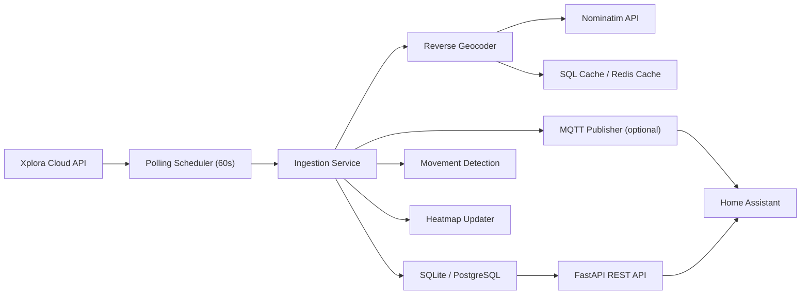

# xplora-gps-recorder

`xplora-gps-recorder` is a Dockerized backend service that polls GPS locations from Xplora smartwatches every 60 seconds, stores the samples in SQLite or PostgreSQL, enriches them with reverse geocoding, derives movement events and heatmap tiles, and exposes the data through a REST API and optional MQTT topics for Home Assistant.

The project is structured so operators without deep Python experience can deploy it, inspect logs, and debug typical failures quickly.

## Recommended Home Assistant mode

For Home Assistant, this project is packaged as a **local add-on**, not as a native custom integration.

That is the better fit because the system is a standalone service with its own scheduler, persistent storage, reverse-geocoding cache, and API surface. Home Assistant's developer docs describe add-ons/apps as separate applications around Home Assistant, while integrations are better suited to code that runs directly inside Home Assistant Core.

Standalone Docker Compose deployment remains fully supported outside Home Assistant.

## Overview

### Features

- Polls multiple Xplora watches every 60 seconds with retry-aware HTTP calls.
- Stores every GPS sample in SQLite or PostgreSQL for long-term history and analysis.
- Uses OpenStreetMap Nominatim reverse geocoding with SQL caching and optional Redis caching.
- Detects movement vs stationary segments with the Haversine formula.
- Builds heatmap tiles by rounded latitude/longitude buckets.
- Exposes REST endpoints for devices, positions, movements, and heatmap tiles.
- Publishes optional MQTT messages compatible with Home Assistant device tracking patterns.
- Ships with Alembic migrations, Docker Compose, structured logging, and unit tests.

### Assumptions

- Xplora does not provide a stable public API contract. This repository therefore uses configurable endpoint paths plus payload normalization heuristics. If your tenant returns different JSON fields, update [`app/xplora_client.py`](app/xplora_client.py).
- All timestamps are stored as timezone-aware UTC datetimes.
- Reverse geocoding is best-effort. A temporary Nominatim outage does not block raw GPS storage.

## Architecture



### Runtime flow

1. APScheduler triggers one polling job every 60 seconds.
2. The Xplora client logs in and fetches all watches.
3. Each device snapshot is stored as a raw `gps_positions` row.
4. Reverse geocoding enriches the position and caches the address.
5. Movement detection compares the point with the previous sample.
6. Heatmap tile counters are incremented.
7. Optional MQTT topics are published for Home Assistant.

## Repository layout

```text
xplora-gps-recorder/
├── .env.example
├── .gitignore
├── CHANGELOG.md
├── CONTRIBUTING.md
├── DOCS.md
├── Dockerfile
├── LICENSE
├── README.md
├── SECURITY.md
├── alembic.ini
├── docker-compose.yml
├── pyproject.toml
├── repository.yaml
├── requirements-dev.txt
├── requirements.txt
├── app/
│   ├── api/
│   │   ├── routes.py
│   │   └── schemas.py
│   ├── db/
│   │   ├── migrations/
│   │   │   ├── env.py
│   │   │   └── versions/0001_initial_schema.py
│   │   ├── models.py
│   │   └── session.py
│   ├── config.py
│   ├── heatmap.py
│   ├── logging_config.py
│   ├── main.py
│   ├── movement_detection.py
│   ├── mqtt_publisher.py
│   ├── reverse_geocode.py
│   ├── scheduler.py
│   ├── services/
│   │   ├── analytics_service.py
│   │   └── location_service.py
│   └── xplora_client.py
├── scripts/
│   └── init_db.py
├── xplora_gps_recorder/
│   ├── config.yaml
│   ├── Dockerfile
│   ├── README.md
│   ├── run.sh
│   ├── app/
│   ├── scripts/
│   └── translations/
└── tests/
    ├── conftest.py
    ├── test_heatmap.py
    ├── test_movement_detection.py
    └── test_xplora_client.py
```

## Installation

### Quickstart with Docker Compose

1. Copy the example config and set real values.

   ```bash
   cp .env.example .env
   ```

2. Edit `.env` with your Xplora values plus either SQLite or PostgreSQL database settings.

3. Build and start the stack.

   ```bash
   docker compose up --build -d
   ```

4. Open the API docs at [http://localhost:8000/docs](http://localhost:8000/docs).

### Quickstart as a Home Assistant add-on

1. In Home Assistant, open `Settings -> Add-ons -> Add-on Store`.
2. Open the three-dot menu and choose `Repositories`.
3. Add `https://github.com/Feberdin/xplora-gps-recorder`.
4. Install **Xplora GPS Recorder**.
5. Fill the add-on options. For most installs, keep the default SQLite path and only enter the Xplora credentials.
6. Start the add-on and open it via ingress or port `8000`.

### Local development

```bash
python3.11 -m venv .venv
source .venv/bin/activate
pip install -r requirements.txt -r requirements-dev.txt
```

### Local test run in 3 lines

```bash
pip install -r requirements.txt -r requirements-dev.txt
pytest
ruff check .
```

## Configuration

All secrets live in `.env`. Never commit production credentials.

### Core settings

| Variable | Purpose |
| --- | --- |
| `DATABASE_URL` | Optional full SQLAlchemy connection string for PostgreSQL or another supported database |
| `SQLITE_PATH` | Default local database file path used when `DATABASE_URL` is empty |
| `POLL_INTERVAL_SECONDS` | Scheduler interval, default `60` |
| `LOG_LEVEL` | `DEBUG`, `INFO`, `WARNING`, or `ERROR` |
| `LOG_JSON` | JSON logs for container environments |

### Xplora settings

| Variable | Purpose |
| --- | --- |
| `XPLORA_BASE_URL` | Full Xplora GraphQL endpoint, default `https://api.myxplora.com/api` |
| `XPLORA_COUNTRY_CODE` | Required only when `XPLORA_USERNAME` is a phone number instead of an e-mail address |
| `XPLORA_USER_LANG` | Login language such as `de-DE` or `en-GB` |
| `XPLORA_TIME_ZONE` | IANA time zone such as `Europe/Berlin` |
| `XPLORA_TRIGGER_LOCATE` | Ask the watch for a fresh location before reading the latest point |
| `XPLORA_USERNAME` | Xplora account username or e-mail address |
| `XPLORA_PASSWORD` | Xplora account password |
| `XPLORA_LOGIN_PATH` | Legacy REST placeholder, ignored by the current GraphQL mode |
| `XPLORA_DEVICES_PATH` | Legacy REST placeholder, ignored by the current GraphQL mode |
| `XPLORA_LOCATION_PATH` | Legacy REST placeholder, ignored by the current GraphQL mode |

### Reverse geocoding and cache

| Variable | Purpose |
| --- | --- |
| `REVERSE_GEOCODE_ENABLED` | Enable or disable reverse geocoding |
| `REVERSE_GEOCODE_USER_AGENT` | Required Nominatim user agent |
| `REVERSE_GEOCODE_CACHE_PRECISION` | Rounded coordinate precision for cache hits |
| `REDIS_URL` | Optional Redis cache URL |

### MQTT

| Variable | Purpose |
| --- | --- |
| `MQTT_ENABLED` | Enables MQTT publishing |
| `MQTT_HOST` | Broker host |
| `MQTT_PORT` | Broker port |
| `MQTT_USER` | Broker username |
| `MQTT_PASSWORD` | Broker password |
| `MQTT_TOPIC_PREFIX` | Topic prefix, default `kids/watch` |

## Docker deployment

### Start

```bash
docker compose up --build -d
```

### Stop

```bash
docker compose down
```

### Optional Redis cache

```bash
docker compose --profile cache up -d redis
docker compose up --build -d
```

## Home Assistant add-on deployment

Home Assistant add-on metadata lives in:

- [`repository.yaml`](repository.yaml)
- [`xplora_gps_recorder/config.yaml`](xplora_gps_recorder/config.yaml)
- [`xplora_gps_recorder/run.sh`](xplora_gps_recorder/run.sh)
- [`xplora_gps_recorder/DOCS.md`](xplora_gps_recorder/DOCS.md)

The add-on reads its settings from the Supervisor UI and maps them into the same environment variables used by standalone Docker mode. This keeps one codebase and one runtime path for both deployment targets.

## REST API

### Endpoints

- `GET /devices`
- `GET /devices/{device_id}`
- `GET /devices/{device_id}/positions?start_time=2026-04-03T00:00:00Z&end_time=2026-04-03T23:59:59Z&limit=100`
- `GET /devices/{device_id}/movements?limit=100`
- `GET /devices/{device_id}/heatmap?limit=500`

### Example calls

```bash
curl http://localhost:8000/devices
curl "http://localhost:8000/devices/watch-123/positions?limit=10"
curl "http://localhost:8000/devices/watch-123/movements?start_time=2026-04-03T00:00:00Z"
curl "http://localhost:8000/devices/watch-123/heatmap?limit=100"
```

## Home Assistant integration

The recommended path is MQTT because it pushes updates as soon as the poller stores a new position.

### MQTT topics

- `kids/watch/{device_id}/location`
- `kids/watch/{device_id}/movement`
- `kids/watch/{device_id}/battery`

### Example Home Assistant MQTT sensor

```yaml
mqtt:
  sensor:
    - name: "Xplora Watch Battery"
      state_topic: "kids/watch/watch-123/battery"
      value_template: "{{ value_json.battery_level }}"
      unit_of_measurement: "%"
```

### Example Home Assistant REST sensor

```yaml
rest:
  - resource: http://xplora-gps-recorder:8000/devices/watch-123/positions?limit=1
    sensor:
      - name: xplora_watch_latest_position
        value_template: "{{ value_json[0].place_name }}"
```

## Logging and debugging

### Logging concept

- `DEBUG`: raw control flow, field normalization, cache behavior
- `INFO`: startup, polling summaries, successful connections
- `WARNING`: degraded but recoverable issues such as geocoder or MQTT outages
- `ERROR`: request failures that need operator action

Logs go to stdout so `docker compose logs -f app` is the primary debugging command.

### Useful commands

```bash
docker compose logs -f app
docker compose logs -f postgres
docker compose exec postgres psql -U "$POSTGRES_USER" -d "$POSTGRES_DB"
curl http://localhost:8000/health
```

## Troubleshooting

### The app starts but no positions appear

- Check `XPLORA_USERNAME` and `XPLORA_PASSWORD` first.
- If you log in with a phone number, also set `XPLORA_COUNTRY_CODE`.
- Keep `XPLORA_BASE_URL` on the default `https://api.myxplora.com/api` unless you have verified a different endpoint.
- Set `LOG_LEVEL=DEBUG` and inspect the GraphQL login and per-watch polling log lines.

### Reverse geocoding is missing

- Ensure outbound HTTPS to Nominatim is allowed.
- Check whether cache precision is too coarse or too fine for your movement pattern.
- Look for HTTP 429 or timeout warnings in the logs.

### MQTT messages are missing

- Verify `MQTT_ENABLED=true` and `MQTT_HOST` is reachable.
- Subscribe directly with `mosquitto_sub -h <host> -t 'kids/watch/#' -v`.
- Check broker authentication and TLS settings.

### Database connection errors

- If you use SQLite, confirm the configured path is writable.
- If you use PostgreSQL, confirm `DATABASE_URL` matches the database container credentials.
- Run `docker compose ps` and ensure the `postgres` service is healthy.
- Re-run `python scripts/init_db.py` to isolate migration issues.

## Security notes

- Keep `.env` out of Git and rotate Xplora or MQTT credentials if they were exposed.
- Run the container behind a reverse proxy or private network if the API should not be public.
- Restrict PostgreSQL and MQTT access to trusted hosts when you enable them.

## License

This project ships with the MIT License. See [`LICENSE`](LICENSE).
